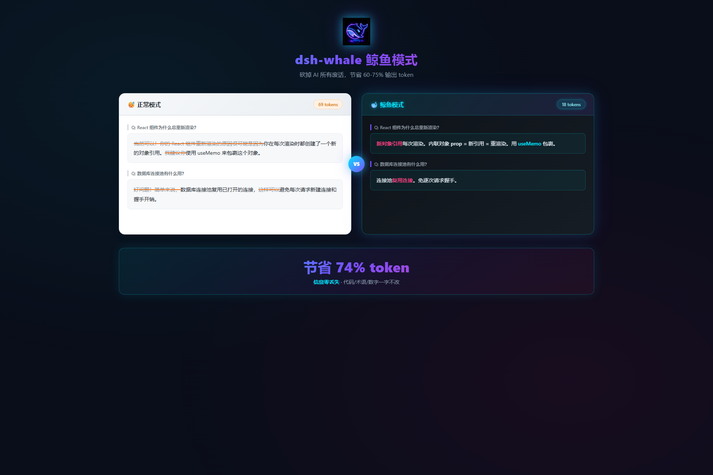

# 🐳 dsh-whale

> 鲸鱼不废话，少词办大事
>
> DeepSeek Harness (DSH) 极简语模式插件 — 砍掉 AI 的所有废话，节省 60-75% 输出 token

[](https://opensource.org/licenses/MIT)
[](https://github.com/deepseek-ai/deepseek-harness)
[](https://github.com/topics/dsh-plugin)

---

## 📊 Before / After



| 正常模式（69 token） | 鲸鱼模式（18 token） |
|---|---|
| "当然可以！你的 React 组件重新渲染的原因很可能是因为你在每次渲染时都创建了一个新的对象引用。我建议你使用 useMemo 来包裹这个对象。" | "新对象引用每次渲染。内联对象 prop = 新引用 = 重渲染。用 useMemo 包裹。" |

**节省：74% token，信息零丢失。**

---

## ⚡ 快速安装

```bash
# 从 GitHub 安装（推荐）
dsh plugin --profile web add github:1Lyn-en/dsh-whale

# 从 npm 安装
dsh plugin --profile web add @1lyn-en/dsh-whale

# 本地开发安装
npm pack
dsh plugin --profile web add ./1lyn-en-dsh-whale-0.1.0.tgz
```

安装后重启 `dsh web`，在对话中输入 `/whale` 即可激活。

---

## 🎚️ 六档模式

| 命令 | 模式 | 效果 | 节省率 |
|------|------|------|--------|
| `/whale lite` | 🐋 轻度 | 去客套话，保留完整句子 | ~40% |
| `/whale` 或 `/whale full` | 🐳 标准（默认） | 去冠词，碎片化表达 | ~60% |
| `/whale ultra` | 🦈 极致 | 一个词能说清不用两个词 | ~75% |
| `/whale wenyan-lite` | 📜 文言轻度 | 半文言，去废话 | ~60% |
| `/whale wenyan-full` | 🏮 文言极致 | 纯文言文，之乎者也 | ~85%（字数） |
| `/whale off` | 🌊 关闭 | 恢复正常说话 | — |
| `/whale status` | — | 查看当前模式和所有选项 | — |

### 文言文示例

> 白话："数据库连接池复用已打开的连接，避免每次请求新建连接和握手开销。"
>
> 文言："池蓄已开之连，不逐请而新开，省握手之费。"

---

## 🔧 核心规则

**砍掉：**
- 冠词（a/an/the）
- 客套话（当然/没问题/很高兴帮你/sure/certainly）
- 填充词（其实/基本上/实际上/just/really/basically）
- 模糊表达（可能/也许/大概/may/might）
- 工具调用前的铺垫（直接调用，不说"我来帮你查"）
- 装饰性表格和 emoji（除非要求）
- 长错误日志（只引用最关键一行）

**保留：**
- 技术术语、代码、API 名、CLI 命令（一字不改）
- 否定词（not/never/no/only/except）— 意思不能变
- 数字、单位、精确值
- 用户使用的语言（中文问就中文答）

---

## 🛡️ 自动清晰度保护

以下场景自动临时退出鲸鱼模式，说清楚后再恢复：

- ⚠️ 安全警告 / 不可逆操作确认（删除、覆盖、发布）
- 📋 多步骤序列（碎片化可能导致顺序误解）
- ❓ 压缩本身产生歧义时
- 🔁 用户要求解释或重复问题时

> 命比 token 重要。

---

## ⚙️ 配置

### 设置默认模式

```bash
/whale-default full    # 设置默认模式为 full（重启后生效）
/whale-default ultra   # 设置默认模式为 ultra
```

### 持久化

- 模式选择自动保存到 DSH 用户设置
- 重启 `dsh web` 后保持当前模式
- 默认模式在新会话中自动激活

---

## 🌐 跨平台支持

本项目同时提供 Claude Code / Codex / Cursor 等平台兼容的 `SKILL.md`：

```bash
# Claude Code
/skill add https://raw.githubusercontent.com/1Lyn-en/dsh-whale/main/cross-platform/SKILL.md
```

---

## 🧪 开发

```bash
# 安装依赖
npm install

# 类型检查
npm run typecheck

# 运行测试
npm test

# 构建
npm run build

# 打包
npm run pack

# 本地安装测试
dsh plugin --profile web add ./1lyn-en-dsh-whale-0.1.0.tgz
```

### 项目结构

```
dsh-whale/
├── src/
│   ├── index.ts              # 插件入口
│   ├── types.ts              # 类型定义
│   ├── prompts/              # 6 档模式 prompt
│   │   ├── whale-lite.ts
│   │   ├── whale-full.ts     # 默认
│   │   ├── whale-ultra.ts
│   │   ├── wenyan-lite.ts
│   │   ├── wenyan-full.ts
│   │   ├── auto-clarity.ts   # 自动清晰度保护
│   │   └── index.ts
│   ├── commands/
│   │   └── whale-command.ts  # /whale 命令
│   └── settings/
│       └── whale-settings.ts # 持久化设置
├── cross-platform/
│   └── SKILL.md              # Claude/Codex 兼容版
├── tests/
│   └── prompt.test.ts
├── cordis.patch.yml          # DSH 插件配置
├── package.json
├── tsconfig.json
└── README.md
```

---

## ❓ FAQ

**Q: 会影响代码生成质量吗？**
A: 不会。代码块、技术术语、API 名完全保留，只压缩自然语言描述。

**Q: 为什么叫鲸鱼？**
A: DeepSeek Harness 官方 IP 是黑色鲸鱼，鲸鱼沉默但智慧，符合"少说话多办事"的理念。

**Q: 和 Caveman 有什么区别？**
A: Caveman 是 Claude Code 生态的先驱，dsh-whale 是 DSH 原生插件，增加了文言文模式、自动清晰度保护、命令切换等 DSH 专属体验。灵感来自 Caveman，代码和 prompt 完全独立。

**Q: 安全吗？**
A: 完全安全。插件只注入 system-prompt 和注册命令，不做任何网络请求，不收集数据，代码完全开源。

---

## 📄 License

MIT © ylin

---

*🐳 鲸鱼不废话，少词办大事。*
